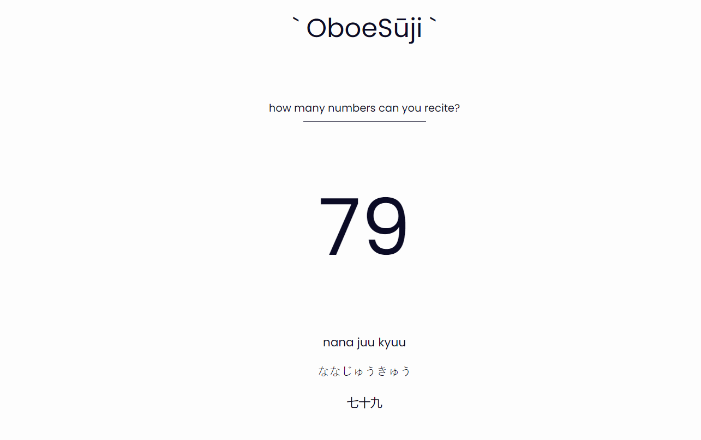

# oboeSūji - Learn Japanese Numbers

## Introduction

**oboeSuji** is a PWA (Progressive Web App) that helps you learn and appreciate Japanese numbers by displaying them in various Japanese scripts. Whether you're a language enthusiast, a student of Japanese, or simply curious about Japanese numerals, this is for you.

## Features

- Convert numerals (0-9) into Japanese representations.
- View numbers in Romaji, Hiragana, and Kanji scripts.
- User-friendly and intuitive interface.
- Learn Japanese numbers effortlessly.

## Getting Started

### Installation

- **Open the URL in a web browser**: https://aditi002-holo.github.io/oboeSuji/
- **Add to homescreen**: Go to menu and add the app to your device by clicking on "Add to homescreen"

### Usage

1. **Launch the App**: After installation, open oboeSuji on your mobile device.

2. **Select a Range**: Select one of the number range buttons

3. **View Japanese Scripts**:
   - **Romaji**: See the number in Romanized Japanese characters.
   - **Hiragana**: View the number in Hiragana script.
   - **Kanji**: Explore the number in beautiful Kanji characters.

4. **Learn and Enjoy**: Explore Japanese numbers and their representations in different scripts. Use oboeSuji to enhance your language skills and cultural knowledge.

## Screenshots

## Author

- Coded by: Aditi Deshpande (https://github.com/Aditi002-holo)
- Japanese Number System Code by: GreatDane (https://github.com/Greatdane)

## Misc

- [Japanese Number System Code](https://github.com/Greatdane/Convert-Numbers-to-Japanese)
## Spread the Word

If you find oboeSuji useful and enjoyable, please consider sharing it with your friends and fellow language enthusiasts. Learning about Japanese numbers has never been this fun and easy!

Thank you for choosing oboeSuji for your Japanese language journey!